# Netty

## 1.简介

> Netty is an asynchronous event-driven network application framework for rapid development of maintainable high performance protocol servers & clients.
>
> Netty是一种**异步事件驱动**的网络应用程序框架，可快速开发可维护的高性能协议服务器和客户端。

事件驱动:基于事件驱动,根据点击事件调用方法

客户端行为进行事件驱动,连接 断开 读 写

- Netty
- NIO
- JDK IO
- TCP/IP


- TCP协议
- NIO框架


### 1.1场景

1. RPC框架
2. 游戏数据交互
3. 大数据领域 数据聚合传递


## 2.Java BIO编程

IO模型:用什么通道进行数据的发送和接收,决定通信性能

Java的三种IO模型

- BIO
- NIO
- AIO

### 2.1 JavaBIO

- 同步阻塞
- 一个请求一个线程处理
- 线程自身会占用资源,过多线程导致OOM
- 线程切换消耗大导致效率低
- socket连接维护线程导致性能浪费

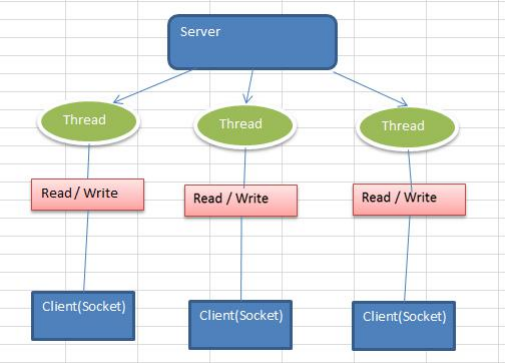

### 2.1 NIO

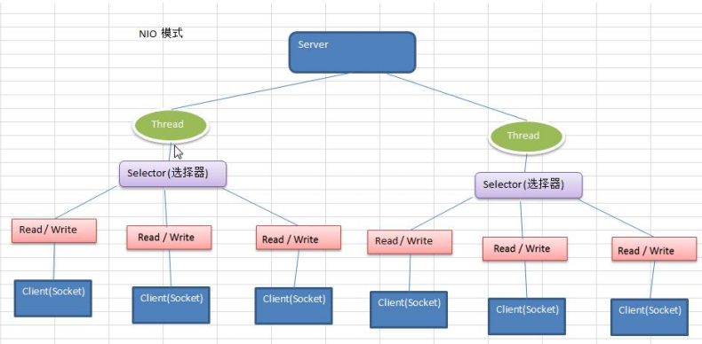

- 单线程维护多个请求从而提高利用率
- 理论基础:单个连接建立连接后不一定一直进行数据交互,空闲时让线程去处理其他连接的请求从而提高效率


### 2.3 AIO

- 异步非阻塞
- 异步通道
- 先经过操作系统判定,有效请求校验
- 链接数多,连接时间长


### 2.4场景

- BIO 连接数量少 固定架构
- NIO 连接数量多,连接操作短,轻架构 聊天服务器 弹幕服务器 服务器之间的通讯
- AIO 连接数多 连接时间长 重操作,相册服务器 充分调用OS进行并发JDK7之后支持


## 3. Java阻塞队列

任务分为两种

- IO密集型

  IO密集型则设置为
  $$
  N_{cpu}+1
  $$
  额外的一个线程确保任务线程在被阻塞无法使用的时间确保CPU资源不被浪费

- CPU密集型

  计算密集型的任务线程数=CPU处理个数（线程数）


延迟

> 线程执行栈的大小可以通过[-Xsssize或-XX:ThreadStackSize](https://docs.oracle.com/javase/8/docs/technotes/tools/unix/java.html)参数调整

混合型任务线程数计算
$$
threads=\frac{cores}{1-blockingCoefficient}=cores*(1+\frac{waitTime}{computeTime})
$$


**阻塞队列基本方法**

|             | *Throws exception* | *Special value* | *Blocks*         | *Times out*          |
| ----------- | ------------------ | --------------- | ---------------- | -------------------- |
| **Insert**  | add(e)             | offer(e)        | put(e)           | offer(e, time, unit) |
| **Remove**  | remove()           | poll()          | take()           | poll(time, unit)     |
| **Examine** | element()          | peek()          | *not applicable* | *not applicable*     |

**Consumer/Provider模型**


- 入队使用offer，若失败则创建新的临时线程
- 出队使用take()实现阻塞队列的效果，若无任务则阻塞等待

> 事实上，工作线程的超时销毁是调用`offer(e, time, unit)`实现的。

### 类图


#### ArrayBlockingQueue

- 通过final修饰ReentrantLock表明
- 每个阻塞队列只能使用同一把锁从而处理线程安全问题
- final是锁定指向栈空间指针不能变化，基本数据类型就是不可变，但是对象只是无法指向其他对象

一个环形的阻塞队列，通过count统计总数，通过putIndex分割有效和无效

#### SynchronousQueue

一个可视作空的阻塞队列

- 生产者可不断生产
- 消费者可不断消费
- 无容量，每次任务使用线程处理，核心线程不够开启辅助线程
- 线程太多导致OOM

#### LinkedBlockingQueue

- 默认无限容量（Integer.MAX_VALUE）

  > 按照官方文档的说法LinkedBlockingQueue是一种**可选有界(optionally-bounded)阻塞队列**。

- 这是一个由**单链表实现**的**默认无界**的阻塞队列。LinkedBlockingQueue提供了一个可选有界的构造函数，而在未指明容量时，容量默认为Integer.MAX_VALUE。


## 4. BIO 模拟服务器

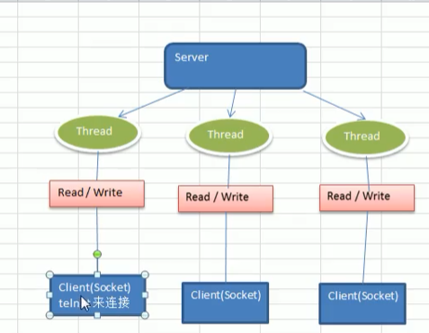

```java
@Test
public void myServer() throws Exception{
    ServerSocket serverSocket = new ServerSocket(6666);
    while (true){
        Socket socket = serverSocket.accept();
        socketHandler(socket);
    }
}

public void socketHandler(Socket socket) {
    try {
        InputStream inputStream = socket.getInputStream();
        byte[] buffer = new byte[1024];
        while (inputStream.read(buffer) != -1){
            System.out.println("new String(buffer,0,buffer.length) = " + new String(buffer, 0, buffer.length));
        }
    } catch (IOException e) {
        e.printStackTrace();
    }finally {
        try {
            socket.close();
        } catch (IOException e) {
            e.printStackTrace();
        }
    }
}
```

- 若不开启子线程处理socket那么接下去的连接将会被阻塞
- 每来一个连接就启动一个线程去处理


**BIO缺陷**

- 线程过多触发OOM
- 线程资源浪费


## 5. Java NIO

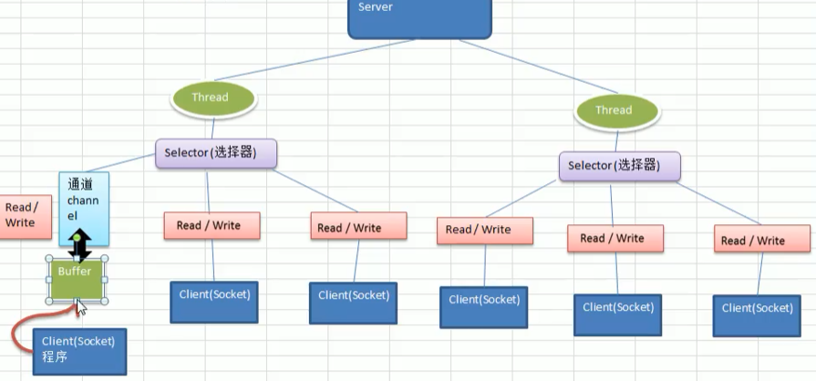


- Java NIO
  - java non-blocking IO
  - java new IO
  - JDK的新版本API 1.4之后提供的一系列改进输入输出的新特性
  - 同步非阻塞
- 在java.nio包下，对原有java.io包下许多列做了变动
- 三大核心
  - Channel 通道
  - Buffer 缓冲区
  - Selector 选择器
- NIO面向缓冲区、面向块。数据到缓冲区，缓冲区和移动遍历从而提高非阻塞高伸缩性
  - 数据处理从连接移动到缓冲区从而实现非阻塞
- Java NIO的非阻塞：使一个线程从某通道发送请求或者读取数据，读取只能读到可用数据，数据不可用则读不到，**而不是保持线程阻塞**。非阻塞写：一个线程请求写入一些数据到通道，不需要完全写入就可以做别的
  - 推测：一个线程处理多个连接，连接忙碌（发送请求）则处理，若多个一起请求则逐个处理（同步）线程不阻塞，从任务池不断获取任务执行，其实主要就是一对多了
  - 基于事件驱动，哪个通道出发了事件（读、写、连接）就去处理
- 通俗理解：NIO就是一个线程处理多个操作。假设10000个请求过来，若是BIO则开启10000个线程，NIO则是可开启50/100个线程来处理。
- HTTP2.0使用多路复用计数，做到一个连接并发处理多个请求，而且并发请求的数量比HTTP1.1大了好几个数量级
- 假设
  - Buffer解决read的阻塞问题
  - Channel解决accpet的阻塞问题
  - selector则是代表线程执行任务
- 

### Buffer的使用

- buffer代表缓冲
  - Java的缓冲？内存缓冲可用hashMap实现
- 是一个容器么
- 一个队列，观察者设计模式？
- buffer为什么没有boolean

**BIO VS NIO**

- BIO流式处理，NIO块式处理，块处理速度块
- BIO阻塞，NIO非阻塞
- BIO基于字节流和字符流，NIO基于Channel和Buffer，selector用于监听事件。单线程监听多个客户端通道，通过buffer解耦数据与连接，连接后的数据准备交给线程处理，通过数据池buffer可以同时处理多个连接所需要的数据，从而实现非阻塞

### NIO三大核心原理

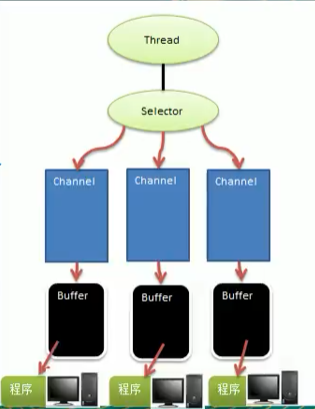

- 每个channel对应一个buffer
- 一个selector对应一个线程，一个线程对应多个channel（连接）
- 三个channel注册到了该selector
- 程序切换到哪个channel是由事件决定
- selector根据事件切换channel
- buffer是一个内存块，底层是一个数组 
- 数据的读取写入从BIO的与连接挂钩变为到buffer关联，数据要么输入、要么输出，NIO的buffer是双向的可读可写，需要使用flip切换
- channel双向可反应底层操作系统的情况，linux的底层操作系统通道就是双向的

### 缓冲区（Buffer）

> 缓冲区（Buffer）：本质上是可读写数据的内存块，可理解位一个容器对象（含数组），该对象提供了一组方法，可以更轻松地使用内存块，缓冲区对象内置了一些机制，能够追踪和记录缓冲区的方法变化状态。Channel提供从文件、网络读取数据的渠道，但是读取或写入数据必须经由Buffer

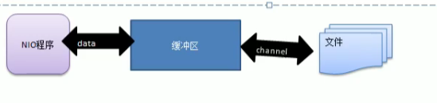

缓冲区树形

- capacity

  容量，可容纳的最大数据量，创建指定无法更改

- limit

  可修改的终点位置

  和capacity的区别是什么

  limit提供的变化的方法用来限制读取，比如capacity位5 limit为3 position为0那么只能读取前三个

  代表有数据的位置

- position

  下一次要读/写的元素索引

- mark

  标记


- flip代表数组当前下标的反转

  - ```java
    limit = position;
    position=0;
    flag=-1;
    ```

  - mark用于标记位置，记录position的位置

- java.nio.BufferOverflowException 若读取完成后position到末尾此时继续添加元素超过limit/capacity 抛出此异常

### 通道（Channel）

> - Java子类实现接口 修饰符范围>=父类/接口
> - 返回值更为细致（只能是相同或子类）

channel类似stream（input/output stream）

- NIO的通道类似流，但是差异如下

  - 通道可以同时读写，流只能读或者只能写

  - 通道可以实现异步读写数据

    推论：通道通过缓冲区实现异步

  - 通道可与缓冲区交互完成数据读写

- Channel在NIO中是一个接口

- 常用的channel：

  - FileChannel

    - 文件读写

    - read 从缓冲区读取数据到通道

    - write 通道数据放到缓冲区
    - 通道中持有数据，缓冲区也持有数据
    - `transferFrom(ReadableByteChannel src,long position, long count)`从目标通道复制数据到当前通道
    - `transferTo(long position, long count, WritableByteChannel target)`从当前通道复制到目标通道

    

  - DatagramChannel

    UDP的数据读写

  - ServerSocketChannel

    TCP的数据读写

  - SocketChannel 

- Input/OutputStream变为了 channel

- byte[] 变为了byteBuffer

- 单buffer进行文件拷贝，buffer反转即可

- channel与stream有什么区别

- channel能实现stream的所有功能

- byteBuffer必须复位，只是反转无法将limit重置，若下次读取的数据更多则出现问题

```java
@Test
public void fileWrite() throws IOException {
    String s = "hello dota2 测试";
    // 创建输出流
    FileOutputStream fileOutputStream = new FileOutputStream("E:\\Learning\\file01.txt");
    // 通过输出流获取对应channel FileChannel是对Java input/output Stream的包装
    // 真实类型是FileChannelImpl
    FileChannel fileChannel = fileOutputStream.getChannel();
    // 创建缓冲区 buffer有提高效率的作用？避免一直写，而是数据集合到了一块再写
    ByteBuffer byteBuffer = ByteBuffer.allocate(1024);
    // 若s过长则产生风险 若读取的长度固定则无风险
    byteBuffer.put(s.getBytes(StandardCharsets.UTF_8));
    // byteBuffer数据写入文件
    // 反转position 再读取
    byteBuffer.flip();
    // 推论：channel中有数据就自动去写，直接往文件描述符中写入数据
    fileChannel.write(byteBuffer);
    // 关闭流
    fileOutputStream.close();
}

@Test
public void fileRead() throws IOException {
    // input/outputStream包含一个channel
    // 相反执行
    FileInputStream fileInputStream = new FileInputStream("E:\\Learning\\file01.txt");
    // 从stream获取channel
    FileChannel fileChannel = fileInputStream.getChannel();
    // channel写入buffer
    ByteBuffer byteBuffer = ByteBuffer.allocate((int) fileChannel.size());
    fileChannel.read(byteBuffer);
    // byteBuffer转为String
    System.out.println("new String(byteBuffer.array()) = " + new String(byteBuffer.array()));
    fileInputStream.close();

}

@Test
public void fileCopy() throws IOException{
    FileInputStream fileInputStream = new FileInputStream("E:\\Learning\\file01.txt");
    FileChannel file01Channel = fileInputStream.getChannel();

    FileOutputStream fileOutputStream = new FileOutputStream("E:\\Learning\\file02.txt");
    FileChannel file02Channel = fileOutputStream.getChannel();

    // 定义buffer进行数据流动
    ByteBuffer byteBuffer = ByteBuffer.allocate((int) file01Channel.size());
    while (file01Channel.read(byteBuffer)>-1){
        byteBuffer.flip();
        file02Channel.write(byteBuffer);
        // 重置，以免limit以及position没有复位导致不断往后可能导致超出限制
        byteBuffer.clear();

    }
    // 流关闭
    fileInputStream.close();
    fileOutputStream.close();
}
```

**通过channel直接完成流拷贝 **

- 源码通过`MappedByteBuffer`进行文件拷贝，而`MappedByteBuffer`持有一个文件描述符
- 文件描述符可理解为文件的索引
- linux下文件存储在硬盘上，硬盘上的数据存储在扇区中（一个扇区512KB）
- 一般读取就读取8个扇区构成的块提高效率
- inode代表文件元数据
- linux判断文件有效类似使用引用计数的方式（inode中保存指向文件的硬链接数量，若该数量归零则代表文件被删除）

```java
	@Test
    public void transferCopy() throws IOException{
        // 图片拷贝
        FileInputStream fileInputStream = new FileInputStream("E:\\Learning\\netty\\招募海报.jpg");
        FileOutputStream fileOutputStream = new FileOutputStream("E:\\Learning\\netty\\樱都招募海报.jpg");
        FileChannel sourceChannel = fileInputStream.getChannel();
        FileChannel destChannel = fileOutputStream.getChannel();
        // 相同channel的数据转移会抛出java.nio.channels.NonReadableChannelException
        destChannel.transferFrom(sourceChannel,0,sourceChannel.size());
        fileInputStream.close();
        fileOutputStream.close();
    }
```

**Buffer和channel的注意事项/细节**

- ByteBuffer支持类型化的put/get（泛型） 若存取的数据格式不一致抛出BufferUnderflowException

- 可以将一个普通的Buffer转为只读Buffer

- NIO提供了MappedByteBuffer,可以让文件直接在内存（对外的内存）中进行修改，而如何同步到文件由NIO来完成

  ```java
      @Test
      public void mappedBufferTest() throws IOException{
          // 堆外内存修改
          RandomAccessFile randomAccessFile = new RandomAccessFile("E:\\Learning\\file01.txt", "rw");
          // 获取通道
          FileChannel fileChannel = randomAccessFile.getChannel();
  
          // mappedByteBuffer 堆外内存修改 不用拷贝到虚拟机内存，由操作系统直接执行，效率高，对文件的修改实时生效（不用close也会生效）
          MappedByteBuffer mappedByteBuffer = fileChannel.map(FileChannel.MapMode.READ_WRITE, 0, 5);
          mappedByteBuffer.put(2, (byte) 'Y');
          randomAccessFile.close();
          System.out.println("FileChannelTest.mappedBufferTest");
  
      }
  ```

  

- 文件读写都是通过一个buffer完成，NIO还支持通过多个buffer即buffer数组完成读写操作（Scattering）和（gatering）

  - 代码内部自动实现看不到

- 通过selector支持多线程而不是线程池

### 选择器（selector）

> - **基本介绍**
>   Java 的 NIO，用非阻塞的 IO 方式。可以用一个线程，处理多个的客户端连接，就会使用到Selector(选择器)
> - Selector 能够检测多个注册的通道上是否有事件发生(注意:多个Channel以事件的方式可以注册到同一个Selector)，如果有事件发生，便获取事件然后针对每个事件进行相应的处理。这样就可以只用一个单线程去管理多个通道，也就是管理多个连接和请求。【示意图】
> - 只有在 连接/通道 真正有读写事件发生时，才会进行读写，就大大地减少了系统开销，并且不必为每个连接都创建一个线程，不用去维护多个线程
>   避免了多线程之间的上下文切换导致的开销

- 一个selector聚合多个input/outputStream
- 监听者设计模式，通道发生事件向selector发送消息让其处理
  - 具体实现：channel中维护selector，channel发生事件向selector发送通知
- 基于事件驱动，事件发送进行读写减少系统开销
- 在内部，将会为每个 Channel 分配一个 EventLoop，用以处理所有事件


> - Netty 的 IO 线程 NioEventLoop 聚合了 Selector(选择器，也叫多路复用器)，可以同时并发处理成百上千个客户端连接。
> - 当线程从某客户端 Socket 通道进行读写数据时，若没有数据可用时，该线程可以进行其他任务。
> - 线程通常将非阻塞 IO 的空闲时间用于在其他通道上执行 IO 操作，所以单独的线程可以管理多个输入和输出通道。
>   由于读写操作都是非阻塞的，这就可以充分提升 IO 线程的运行效率，避免由于频繁 I/O 阻塞导致的线程挂起。
> - 一个 I/O 线程可以并发处理 N 个客户端连接和读写操作，这从根本上解决了传统同步阻塞 I/O 一连接一线程模型，架构的性能、弹性伸缩能力和可靠性都得到了极大的提升。

- 线程组合selector（选择器/多路复用器），同时处理成败上千个客户端的连接
- socket建立连接后无数据可用即可执行其他任务
- 读写操作的非阻塞可避免线程挂起（读写的阻塞引发线程阻塞挂起）
- 由于非阻塞的性质提高可靠性、性能、弹性伸缩能力
- selector 持有channel的列表
- `SelectionKey`代表channel关联到selector 的令牌

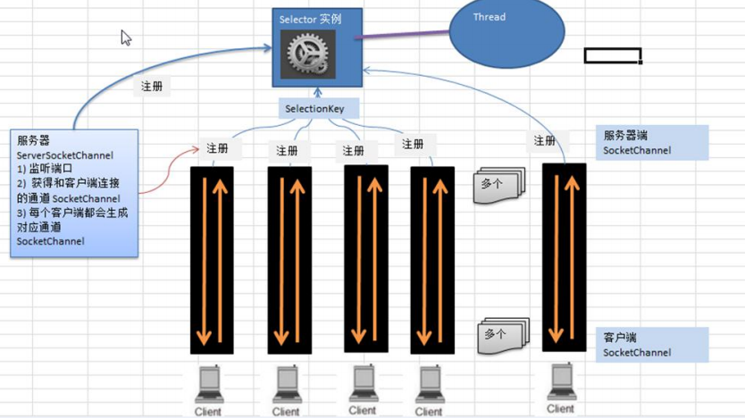

1. 服务端开启监听
2. 客户端连接产生socketChannel
3. SocketChannel注册到selector中，并且返回一个SelectionKey，key中内置了SocketChannel
4. selector轮询扫描SelectionKey容器，看看有没有事件触发
5. 事件触发则通过key获取Chnanel并进行相应IO操作


- selector.select是阻塞还是非阻塞，允许注册channel么

  是带超时的阻塞，半阻塞

- 通过超时阻塞打断阻塞


### NIODemo

- 服务端同样开启监听，但是使用select进行半阻塞监听
- 若有事件触发通过selector的selectionKeys进行事件遍历并进行处理
- 处理过程中可将事件继续注册到selector中，在下一轮扫描时读到并执行
- 客户端置为非阻塞向服务器发起连接，连接未完成时可进行其他操作

```java
    @Test
    public void ServerTest() throws IOException {
        // 服务端
        // 开启serverSocketChannel
        ServerSocketChannel serverSocketChannel = ServerSocketChannel.open();

        // 开启selector
        Selector selector = Selector.open();
        // serverSocketChannel 监听端口
        serverSocketChannel.bind(new InetSocketAddress(6666));
        // 置为非阻塞 阻塞状态无法注册事件
        serverSocketChannel.configureBlocking(false);

        // 注册到selector
        serverSocketChannel.register(selector, SelectionKey.OP_ACCEPT);
        while (true){
            // 开启事件监听
            if (selector.select(1000) == 0){
                System.out.println("无事发生");
                continue;
            }

            // 获取selectionKeys
            Set<SelectionKey> selectionKeys = selector.selectedKeys();
            Iterator<SelectionKey> iterator = selectionKeys.iterator();
            // 流程：
            // 1.客户端连接触发acceptable事件因此进入循环找到事件为连接并处理
            // 2.结束这一轮循环，处理过程中将数据传输事件放到了selector中
            // 3.下一轮循环监听到read事件进行数据读取并展示
            while (iterator.hasNext()){
                SelectionKey selectionKey = iterator.next();
                // 根据事件做出对应操作
                if (selectionKey.isAcceptable()){
                    // 接收请求
                    SocketChannel socketChannel = serverSocketChannel.accept();
                    // 设定为非阻塞
                    socketChannel.configureBlocking(false);
                    // 继续注册到selectorChannel
                    socketChannel.register(selector,SelectionKey.OP_READ,ByteBuffer.allocate(1024));
                }
                if (selectionKey.isReadable()){
                    // 从key获取channel
                    SocketChannel socketChannel = (SocketChannel) selectionKey.channel();
                    // 从key获取之前注册的buffer
                    ByteBuffer buffer = (ByteBuffer) selectionKey.attachment();
                    socketChannel.read(buffer);
                    System.out.println("from 客户端:" + new String(buffer.array()));

                }

                // 事件移除selectionKey
                iterator.remove();
            }

        }

    }

    @Test
    public void client() throws IOException {
        // 连接到服务器
        SocketChannel socketChannel = SocketChannel.open();
        InetSocketAddress inetSocketAddress = new InetSocketAddress("127.0.0.1", 6666);
        // 非阻塞模式
        socketChannel.configureBlocking(false);
        if (!socketChannel.connect(inetSocketAddress)){
            while (!socketChannel.finishConnect()){
                System.out.println("客户端完成连接前可做别的事");
            }
            // 完成连接后通过buffer向服务端发送数据
            String str = "hello 服务器";
            ByteBuffer byteBuffer = ByteBuffer.wrap(str.getBytes(StandardCharsets.UTF_8));
            socketChannel.write(byteBuffer);
        }
        System.in.read();

    }
```

### 方法整理

#### SelectionKey

> 表示 Selector 和网络通道的注册关系, 共四种:
>
> int OP_ACCEPT：有新的网络连接可以 accept，值为 16
> int OP_CONNECT：代表连接已经建立，值为 8
> int OP_READ：代表读操作，值为 1 
> int OP_WRITE：代表写操作，值为 4
> 源码中：
> public static final int OP_READ = 1 << 0; 
> public static final int OP_WRITE = 1 << 2;
> public static final int OP_CONNECT = 1 << 3;
> public static final int OP_ACCEPT = 1 << 4;
>
> public abstract class SelectionKey {
>      public abstract Selector selector();//得到与之关联的 Selector 对象
>  public abstract SelectableChannel channel();//得到与之关联的通道
>  public final Object attachment();//得到与之关联的共享数据
>  public abstract SelectionKey interestOps(int ops);//设置或改变监听事件
>  public final boolean isAcceptable();//是否可以 accept
>  public final boolean isReadable();//是否可以读
>  public final boolean isWritable();//是否可以写
> }

- 将某个通道的某个事件注册到selector的keys集合中
- 是selector以及channel的关联对象
- 可判定selectionKey的绑定事件
- 绑定事件可改变

#### ServerSocketChannel 

> public abstract class ServerSocketChannel    extends AbstractSelectableChannel    implements NetworkChannel{
> public static ServerSocketChannel open()，得到一个 ServerSocketChannel 通道
> public final ServerSocketChannel bind(SocketAddress local)，设置服务器端端口号
> public final SelectableChannel configureBlocking(boolean block)，设置阻塞或非阻塞模式，取值 false 表示采用非阻塞模式
> public SocketChannel accept()，接受一个连接，返回代表这个连接的通道对象
> public final SelectionKey register(Selector sel, int ops)，注册一个选择器并设置监听事件
> }

- 监听客户端连接

#### SocketChannel

> public abstract class SocketChannel    extends AbstractSelectableChannel    implements ByteChannel, ScatteringByteChannel, GatheringByteChannel, NetworkChannel{
> public static SocketChannel open();//得到一个 SocketChannel 通道
> public final SelectableChannel configureBlocking(boolean block);//设置阻塞或非阻塞模式，取值 false 表示采用非阻塞模式
> public boolean connect(SocketAddress remote);//连接服务器
> public boolean finishConnect();//如果上面的方法连接失败，接下来就要通过该方法完成连接操作
> public int write(ByteBuffer src);//往通道里写数据
> public int read(ByteBuffer dst);//从通道里读数据
> public final SelectionKey register(Selector sel, int ops, Object att);//注册一个选择器并设置监听事件，最后一个参数可以设置共享数据
> public final void close();//关闭通道
> }

- 连接到服务器
- 承担数据读写任务


### NIO群聊

> 编写一个 NIO 群聊系统，实现服务器端和客户端之间的数据简单通讯（非阻塞）
> 实现多人群聊
> 服务器端：可以监测用户上线，离线，并实现消息转发功能
> 客户端：通过channel 可以无阻塞发送消息给其它所有用户，同时可以接受其它用户发送的消息(有服务器转发得到)
> 目的：进一步理解NIO非阻塞网络编程机制

- 通过JavaNIO+Server/Socket Channel，编写群聊demo

  主要流程如下：

  - 服务器端开启客户端accept事件监听等待客户端连接
  - 客户端连到服务器端，并注册到selector中，开启子线程 等待读取从服务器端发来的消息
  - 服务器端接到accept请求，注册新的等待读取客户端数据的事件到selector
  - 客户端发送消息
  - 服务器端收到消息，并进行转发（keys） 判断非当前key的channel
  - 客户端接到消息解析输出

- 踩坑

  - 不能在finally中强制关闭客户端导致客户端离线
  - 若消息长度过长怎么处理呢 腾讯的处理方案是 文字处理过长转为文件发送
  - channel必须在注册之前置为非阻塞，selector是非阻塞
  - 服务channel注册到selector 注意注册的事件类型，客户端才是CONNECT

- 

### NIO与零拷贝

[参考](https://www.cnblogs.com/ericli-ericli/articles/12923420.html)

> 零拷贝（zero-copy）是一种目前只有在使用 NIO 和 Epoll 传输时才可使用的特性。它使你可以快速高效地将数据从文件系统移动到网络接口，而不需要将其从内核空间复制到用户空间，其在像 FTP 或者HTTP 这样的协议中可以显著地提升性能。但是，并不是所有的操作系统都支持这一特性。特别地，它对于实现了数据加密或者压缩的文件系统是不可用的——只能传输文件的原始内容。反过来说，传输已被加密的文件则不是问题。

- 零拷贝就是减少操作系统的状态切换(用户态与内核态/上下文切换)来带的性能消耗
- 零拷贝减少系统内核缓冲区和用户进程缓冲区反复的IO拷贝操作

**传统IO**


**mmap技术**


**sendFile最终版**


> mmap的优化点在于数据从硬盘拷到内核态的空间后不需要从内核态空间拷贝到用户态空间

mmap和sendFile的区别

- mmap 适合小数据量读写，sendFile 适合大文件传输。
- mmap 需要 4 次上下文切换，3 次数据拷贝；sendFile 需要 3 次上下文切换，最少 2 次数据拷贝。
- sendFile 可以利用 DMA 方式，减少 CPU 拷贝，mmap 则不能（必须从内核拷贝到 Socket 缓冲区）。

> 所以，如果你需要优化网络传输的性能，或者文件读写的速度，请尽量使用零拷贝。它不仅能较少复制拷贝次数，还能较少上下文切换，缓存行污染。
>
>  kafka 在客户端和 broker 进行数据传输时，会使用 transferTo 和 transferFrom 方法，即对应 Linux 的 sendFile。
>
>  tomcat 内部在进行文件拷贝的时候，也会使用 transferto 方法。
>
> tomcat 在处理一下心跳保活时，也会调用该 sendFile 方法。

- transferFrom/To就是零拷贝在Java中的命令实现?


#### 小结

[参考](https://zhuanlan.zhihu.com/p/78869158)

- DMA的作用
  - DMA直接让内存与磁盘上存储的数据交互而不需要CPU进行IO请求+中断的介入从而提高效率
- Java NIO提供的内存映射 MappedByteBuffer
  - 首先要说明的是，JavaNlO中 的Channel (通道)就相当于操作系统中的内核缓冲区，有可能是读缓冲区，也有可能是网络缓冲区，而Buffer就相当于操作系统中的用户缓冲区。
- Java NIO提供的send file  transferTo()的实现方式就是通过系统调用sendfile() (当然这是Linux中的系统调用)
- NIO与AIO的区别,在于同步与异步,同步指客户端自己去处理IO操作,异步指给出任务由操作系统进行IO操作


## 6.Netty

> 原生NIO存在的问题
>
> - NIO 的类库和 API 繁杂，使用麻烦：需要熟练掌握 Selector、ServerSocketChannel、SocketChannel、ByteBuffer 等。
> - 需要具备其他的额外技能：要熟悉 Java 多线程编程，因为 NIO 编程涉及到 Reactor 模式，你必须对多线程和网络编程非常熟悉，才能编写出高质量的 NIO 程序。
> - 开发工作量和难度都非常大：例如客户端面临断连重连、网络闪断、半包读写、失败缓存、网络拥塞和异常流的处理等等。
> - JDK NIO 的 Bug：例如臭名昭著的 Epoll Bug，它会导致 Selector 空轮询，最终导致 CPU 100%。直到 JDK 1.7 版本该问题仍旧存在，没有被根本解决。

- JavaNIO的问题
  - 学习成本高,开发难度大
  - epoll bug导致selector空轮询


### 概述

> Netty is *an asynchronous event-driven network application framework* for rapid development of maintainable high performance protocol servers & clients.
>
> Netty 是由 JBOSS 提供的一个 Java 开源框架。Netty 提供异步的、基于事件驱动的网络应用程序框架，用以快速开发高性能、高可靠性的网络 IO 程序
>  Netty 可以帮助你快速、简单的开发出一个网络应用，相当于简化和流程化了 NIO 的开发过程
> Netty 是目前最流行的 NIO 框架，Netty 在互联网领域、大数据分布式计算领域、游戏行业、通信行业等获得了广泛的应用，知名的 Elasticsearch 、Dubbo 框架内部都采用了 Netty。

- netty是异步,基于事件驱动的网络应用框架,可以快速开发可维护的高性能协议服务器/客户端.
  - 这里的异步指非阻塞
  - 本质上，一个既是异步的又是事件驱动的系统会表现出一种特殊的、对我们来说极具价值的行为：它可以以任意的顺序响应在任意的时间点产生的事件。
- 开源 流行 社区活跃 快速开发


优势

- 设计优雅

  适用于各种传输类型的统一 API 阻塞和非阻塞 Socket；基于灵活且可扩展的事件模型，可以清晰地分离关注点；高度可定制的线程模型 - 单线程，一个或多个线程池.

- 使用方便

  使用方便：详细记录的 Javadoc，用户指南和示例；没有其他依赖项，JDK 5（Netty 3.x）或 6（Netty 4.x）就足够了。

- 高性能\吞吐量更高

  延迟更低；减少资源消耗；最小化不必要的内存复制

- 安全

  完整的 SSL/TLS 和 StartTLS 支持

- 社区活跃,不断更新

  社区活跃，版本迭代周期短，发现的 Bug 可以被及时修复，同时，更多的新功能会被加入


### Reactor模式

- 使用epoll+线程池解决阻塞+线程过多问题
- serviceHandler类似dispatcherServlet
- 通过serviceHandle进行输入处理,分发,线程接到请求后处理\
- 单reactor 多线程
  - 利用CPU多核能力
  - reactor自身的并发问题
- 主从Reactor多线程
  - 解决reactor自身并发问题,reactor拆为主从
  - 主reacotr处理accept事件
  - 子reactor则处理具体数据读写事件,子reactor可以有多个
- 


#### 小结

- 线程模型

  - 传统IO服务模型
    - 阻塞
    - 一个请求一个线程处理
  - REACTOR模型
    - 单reactor单线程
    - 单reactor多线程
    - 主从reactor多线程

- 传统IO模型的问题

  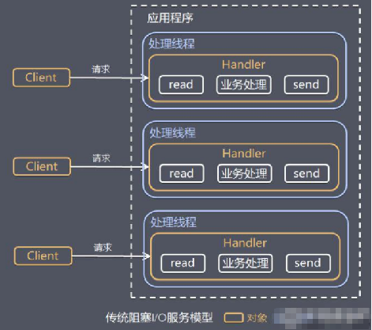

  - 随着并发上升,线程不断增加
  - 阻塞,不管是accept操作还是read操作都会引发线程阻塞,无法充分利用线程,资源浪费

- Reactor模式解决的痛点

  - 基于IO复用模型,一个线程客户处理多个连接,只有触发事件后才给出对应响应,非阻塞(Selector,channel,buffer,零拷贝)
  - 基于线程池,线程池来管理具体的工作线程,从而避免线程数无限制增长导致的OOM等资源问题

- Reactor基本设计思路

  - 支持多个输入同时进行
  - 服务端接到后进行请求分发
  - IO服用进行事件监听,从而支持高并发

- Reactor的组成

  - Reactor:分发器,类似dispatcher,进行IO事件的接收,具体事件处理的分发(前台,dispatcherServlet)
  - Handlers:执行IO事件的实际处理(分发给具体任务处理线程处理后返回)

- REACTOR模型

  - 单reactor单线程

    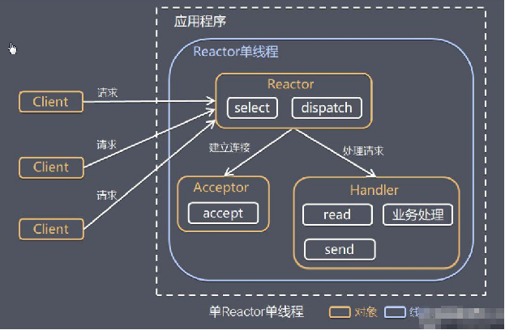

    - 借助select进行事件分类,并进行不同的处理
    - 连接事件则交给acceptor
    - 具体的数据读写事件交给handler
    - handler的流程:Read->业务处理->Send
    - 分析
      - 模型简单,没有多线程
      - 性能问题,只是单线程无法利用CPU的多核多线程
      - reactor+handler的单点故障

  - 单reactor多线程

    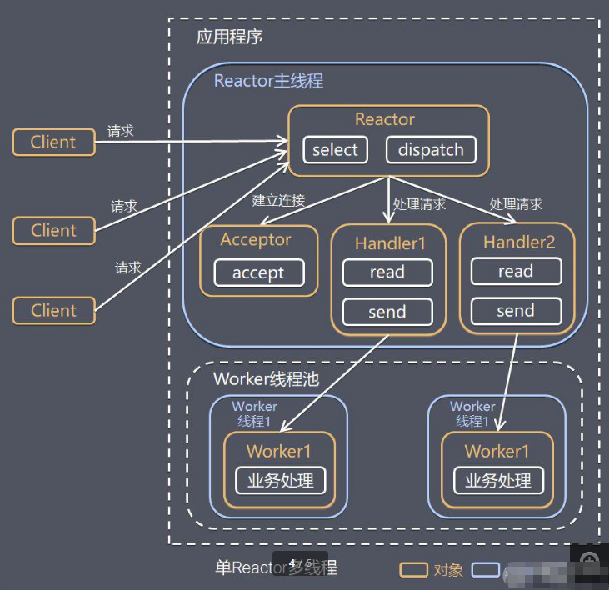

    - reactor接到请求,根据不同事件转发
    - 若是具体IO事件则分发给handler
    - handler只是分发不做具体事件处理
    - handler去worker线程池寻找具体worker进行事件处理
    - worker处理完成后结果返回
    - 分析
      - 解决单线程导致的CPU性能无法利用问题
      - 解决handler的单点问题
      - reactor处理所有事件,单线程的reactor导致问题,包括高性能和可用性

  - 主从reactor多线程

    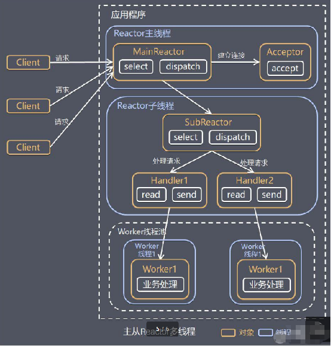

    - 主从reactor将reactor分为主从,主reactor进行accpetor事件的监听,并且将连接分配给子reactor
    - 子reactor将连接加入连接队列监听,并创建handler进行事件处理
    - 具体事件到来
      - subReactor寻找合适的handler
      - handler读取数据寻找合适的worker进行处理,根handlerMapping和handlerAdapter类似
      - worker线程池分配给具体worker处理
      - worker业务处理并返回结果
      - handler收到响应,send结果
    - Reactor 主线程可以对应多个Reactor 子线程, 即MainRecator 可以关联多个SubReactor
    - 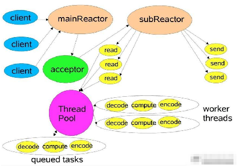
    - 分析
      - 父子reactor对请求类型进行解耦
      - 解决单reactor引发的性能及可靠性问题
      - 交互简单
      - 变成复杂度高
    - 结合实例：这种模型在许多项目中广泛使用，包括 Nginx 主从 Reactor 多进程模型，Memcached 主从多线程，Netty 主从多线程模型的支持

  - 单 Reactor 单线程，前台接待员和服务员是同一个人，全程为顾客服
    单 Reactor 多线程，1 个前台接待员，多个服务员，接待员只负责接待
    主从 Reactor 多线程，多个前台接待员，多个服务生

  - reactor的优势

    - 响应快，不必为单个同步时间所阻塞，虽然 Reactor 本身依然是同步的
    - 可以最大程度的避免复杂的多线程及同步问题，并且避免了多线程/进程的切换开销
    - 扩展性好，可以方便的通过增加 Reactor 实例个数来充分利用 CPU 资源
    - 复用性好，Reactor 模型本身与具体事件处理逻辑无关，具有很高的复用性

